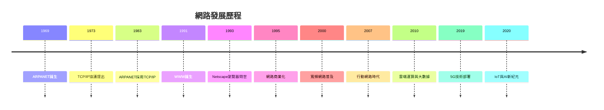

# 從過去到現在的通訊方式

## 傳遞訊息的需求與重要性

- 需要溝通：討論問題、交流觀點、確認事情…
- 需要傳遞：新聞傳播、事實陳述、給予指示…
- 需要留存：專業知識、文化傳承、故事分享、價值觀
- 不同時代有不同的方式：追求更快、更好、更方便

## 傳統到現代的通訊方式

### 1.通訊種類

- 傳統通訊
    
    
    | 傳統通訊種類 | 說明 | 優點 | 限制或缺點 |
    | --- | --- | --- | --- |
    | 口語 | 傳遞消息、經驗、故事、歷史等 | 直接、立即 | 易受語言與文化差異影響 |
    | 告示、招牌、碑文 | 用於宣布政令、通告重要訊息等 | 可傳達一致性訊息 | 廣傳範圍有限 |
    | 書信 | 以紙筆書寫訊息，作為紀錄、溝通、確認方式 | 可傳送至遠方、可留存 | 時效不彰（交通不便） |
    | 長途傳訊：
    －驛送（信使、快馬、驛站、郵驛）－信鴿（飛鴿傳書）
    －烽煙（望樓、鼓樓、瞭望台、監視塔、烽火台） | 用於遠距離傳遞重要訊息 | 根據方式不同，可快速或警示性高 | 受地形、氣候、人力等因素限制 |
- 電信通訊
    
    
    | 電信通信種類 | 說明 | 優點 | 限制或缺點 |
    | --- | --- | --- | --- |
    | **電報** | 最早的電信通信技術，1837 年取得專利，1844 年首次發報。利用電線迴路，以電流開關傳送訊息。 | 可長距離傳輸訊息，精簡高效，提升資訊傳遞速度 | 只能傳送文字（需熟悉摩斯碼），傳送速度有限 |
    | **摩斯電碼** | 將字母、數字轉換為長短電訊號（點、劃），1836 年發明，廣泛應用於通訊、航海、軍事等 | 簡單、易學、可用聲音或光線傳遞 | 資訊量有限，學習與解碼需訓練 |
    | **傳真電報** | 1842 年由亞歷山大．班恩發明。可掃描並遠端印出圖文，是現代傳真機的前身 | 可傳送圖像與文字，為影像傳真奠定基礎 | 機械結構複雜，傳輸速度慢，解析度低 |
    | **電話** | 1876 年由貝爾發明，可透過電線傳送語音，開啟語音即時溝通時代 | 即時語音溝通，使用直觀、提升交流效率 | 早期僅限有線通話，初期成本高、需建設基礎設施 |
    | **有線通信技術** | 利用電線、電纜、光纖等媒介進行資訊傳遞，包含語音、文字、圖像等多媒體 | 穩定、高速、保密性好，支援大量資訊傳輸 | 建設成本高，受地理限制影響較大 |
- 無線通訊
    
    
    | 無線通訊種類 | 說明 | 優點 | 限制或缺點 |
    | --- | --- | --- | --- |
    | **無線電** | 1894~1896 年由馬可尼發明，1901 年首次跨太平洋通信成功（傳送「S」訊號，英國→加拿大，距離約 3,400 公里） | 不需有線連接，實現超長距離通訊 | 易受干擾、需要頻譜管理、設備體積初期較大 |
    | **對講機** | 二戰期間為軍用短距通訊設計，由 Galvin 公司開發；後由 Motorola 推出民用型（HT-200，1962 年） | 快速使用、便於攜帶、即時語音溝通 | 傳輸距離短、頻道有限、易受障礙物影響 |
    | **電磁波應用**（無線網路、4G/5G、藍牙、衛星通訊、紅外線、雷達…） | 利用不同頻段的電磁波進行資料傳輸與感測，廣泛應用於現代生活各領域 | 範圍廣泛、技術成熟、多元應用（資料、語音、影像、感測） | 須配合相容設備、部分應用需授權頻段、可能存在資安風險 |

### 2.訊號種類

類比訊號（Analog Signal）

數位訊號（Digital Signal）

| 比較項目 | 類比訊號（Analog Signal） | 數位訊號（Digital Signal） |
| --- | --- | --- |
| **表示方式** | 連續波形（無限多種值） | 離散的 0 與 1（二進位） |
| **傳輸方式** | 模擬自然變化（電壓、頻率、振幅連續變動） | 將資訊轉為數位編碼後傳輸 |
| **解析度** | 幾乎無限，擬真性高 | 取樣限制，非連續但可達高精度 |
| **抗干擾能力** | 易受雜訊、干擾與衰減影響 | 抗干擾強，訊號可完整重建 |
| **設備需求** | 技術簡單、成本較低 | 需編碼/解碼設備，成本與運算需求較高 |
| **傳輸距離** | 可較遠，但失真風險高 | 經適當處理也可長距離且穩定 |
| **頻寬使用** | 固定頻寬、擴充困難 | 可壓縮、多路傳輸、頻寬效率高 |
| **常見應用** | 類比電視、AM/FM 廣播、GSM/2G 行動通訊 | 數位電視、Wi-Fi、VoIP、3G/4G/5G |
| **訊號複製與儲存** | 每複製一次會劣化 | 可無損複製與永久保存 |
| **適合傳輸內容** | 聲音、影像（自然模擬） | 聲音、影像、文字、數據（多媒體整合） |

### 3.傳輸模式

| 傳輸模式 | 說明 | 優點 | 限制或缺點 | 經典應用 |
| --- | --- | --- | --- | --- |
| **單工
(Simplex)** | 設備只能單向傳輸，無法接收。 | 簡單、成本低、設計簡單。 | 只能傳送或接收，無法雙向通訊。 | 遙控器、收音機、電視廣播等。 |
| **半雙工
(Half-duplex)** | 設備可以交替進行傳送或接收，但同時只能選擇一個方向。 | 可以實現雙向通信，成本相對較低。 | 傳送與接收不能同時進行，會造成延遲。 | 無線對講機、雙向無線電等。 |
| **全雙工
(Full-duplex)** | 設備可以同時進行傳送與接收，雙向通訊不中斷。 | 兩端可以實現即時雙向通訊，提升效率。 | 設備較複雜，成本較高。 | 室內電話、行動電話、網路通訊等。 |

<aside>
📓

- 補充：頻率與頻寬
    - 通訊、信號傳輸處理中常用的概念
    - 頻率 ( Frequency )
        - 每秒可以完成訊號或波形的數量 ( 抖動、震盪次數 )，單位為赫茲 ( Hz )
        - 例如：頻率為 1000Hz 指，每秒可以完成 1000 次訊號或波形的傳輸
    - 頻寬 ( Bandwidth )
        - 指頻率的涵蓋範圍 ( 震盪範圍，信號的最高頻、最低頻的範圍 )，單位也為赫茲 ( Hz )
        - 可視為一個頻道的通訊能力 ( 範圍的使用 )，常被解讀為  ~~傳輸率、傳輸速度…~~
        - 例如：頻寬為 20Hz 至 20kHz，指信號的表示範圍為 20Hz ~ 20kHz。
</aside>

<aside>
📓

- 補充：基頻、窄頻、寬頻
    - 基頻 (Baseband)
        - 單一頻率範圍內直接傳輸信號( 資料 )，沒有調頻或調幅處理
        - 範例：乙太網路 ( Fast Ethernet/ Cat5e/ 100MHz、Gigabit Ethernet/ Cat6/ 250MHz )
    - 寬頻 ( Bandband )
        - 指在一個頻寬範圍內有區分不同小頻寬，做為不同使用，單位也為赫茲 ( Hz )
        - 範例：有線電視 ( 第四台，Cable TV )、
        調頻FM(88MHz~108MHz )
    - 窄頻 ( Narrowband )
        - 指在較小的頻率範圍 ( 小頻寬 ) 內進行的通訊或傳輸的方式
         ( 意味著小資料量 )
        - 範例：寬頻上網 ( 第四台,Broadband Internet over Cable )
        、漢聲廣播電台 ( 北部 106.5MHz )
</aside>

<aside>
📓

- 補充：訊號與信號
    - 大多數的情況下，可以視為相同意思
        - 資料傳輸偏向使用訊號
        - 電信領域偏向使用信號
    - 訊號：一種表示資訊內容的表示方式
        - 可以是轉換後的類比或是數位訊號
        - 內容需要經過調製、編碼、解碼、轉換...
    - 信號：一種描述特定的通訊方式
        - 對 "訊號" 的傳輸、處理、控制方式
        - 可以是電磁波、電壓、電流、光...等形式
</aside>

# 網路的過去與現在

ARPANET是現代互聯網的前身，1969年由美國國防部DARPA創建，用於促進大學和研究機構間的遠程計算機數據交換合作。這開創了網際網路發展的新紀元，以下是其發展歷程：

### 1. **ARPANET的誕生（1969年）**

- ARPANET最初是由四個節點組成，分別位於加州大學洛杉磯分校、斯坦福大學、加州大學聖塔芭芭拉分校和猶他大學。
- 它使用的是包交換技術，這種技術允許數據被分割成小包並通過不同的路由器傳輸，這是現代網際網路的基礎。

### 2. **TCP/IP協議的引入（1970年代末至1980年代初）**

- 1973年，Vinton Cerf和Bob Kahn提出了TCP/IP協議，這是一種標準化的網絡協議，用於實現不同計算機系統之間的通信。
- 1983年，ARPANET正式切換到TCP/IP協議，這使得它可以與其他基於相同協議的網絡互聯，並成為現代互聯網的基礎。

### 3. **網際網路的擴展與商業化（1990年代）**

- 1991年，蒂姆·伯納斯-李發明了萬維網（World Wide Web），這使得網絡的使用變得更加直觀和普及，並引入了網站、瀏覽器和HTTP協議。
- 1993年，網絡瀏覽器Netscape的推出使得普通用戶也能夠輕鬆訪問網絡資源。
- 1990年代中期，互聯網開始商業化，企業和家庭用戶開始普及上網服務。

### 4. **寬帶互聯網和無線技術的發展（2000年代）**

- 隨著寬帶網絡（如DSL、光纖）的普及，互聯網速度得到了大幅提升，用戶能夠更快地下載、上傳數據，並進行多媒體內容的流媒體播放。
- 同時，無線技術（如Wi-Fi和3G/4G移動網絡）也開始普及，使得人們可以在任何地方連接互聯網。

### 5. **現代網路的發展（2010年代至今）**

- 當前的互聯網已經變得更加全球化和高效。雲計算、大數據、物聯網（IoT）和人工智慧等技術的出現，極大地改變了網絡的使用方式和功能。
- 5G網絡的出現預示著互聯網速度將達到前所未有的水平，並進一步促進移動設備和物聯網設備的普及。
- 網際網路連線服務公司 ( ISP, Internet Service Provider ) 提供連網服務、公有IP位置，並確保傳輸品質與安全。ISP需建置基礎設施，包含骨幹網路、數據中心、監控系統、IXP、DNS、郵件伺服器和安全防護系統。
    - ISP 的分類
        - 國際級 ISP ( International ISP )
        政府或認可公司營運，負責國際網路所需建設與運作…
        - 國家級 ISP ( National ISP )
        政府或認可公司營運，負責全國內網路所需建設與運作…
        - 地區型 ISP ( Regional ISP )
        以地區 ( 如台北、桃園 ) 畫分，負責網路相關建設與運作…
        - 本地型 ISP ( Local ISP )
        由當地私人公司營運，提供社區、大樓用戶的網路資源…

### 6. **未來展望**

- 隨著量子計算、區塊鏈、邊緣計算等新興技術的發展，未來的網絡將變得更加智能、高效、安全。
- 網絡將越來越成為人類生活的核心基礎設施，支持各種數字化服務，並將更多的物理設備連接到網絡中。
